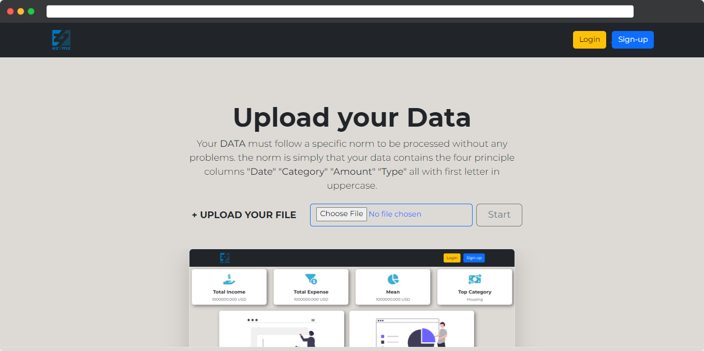

<!-- PROJECT HEADER -->
<div align="center" id="top">
    <a href="">
    
    </a>
    <h3 align="center">Expense Tracker Web App</h3>
    <br />
    <br />
    <p align="center">
        <a href="https://ez7mz.me" target="_blank">
                
        </a>&emsp;
        <a href="https://ensak.usms.ac.ma/ensak/" target="_blank">
                
        </a>&emsp;
        <a href="https://www.linkedin.com/in/ez7mz/" target="_blank">
            
        </a>&emsp;
        <a href="https://www.instagram.com/ez7m.z/" target="_blank">
            
        </a>
    </p>
</div>

<!-- ABOUT THE PROJECT -->
# 📄 About The Project
The project is about building a Dashboard that provides you with a simple analysis of your expenses next to your income. alongside a System tracker if you create an account.



# 🧮 Built With

Through the great journey of working i used these technologies listed below:


&nbsp;
&nbsp;
&nbsp;
&nbsp;
&nbsp;
&nbsp;

<p align="right">(<a href="#top">back to top</a>)</p>

<!-- GETTING STARTED -->
# 🏁 Getting Started

To get a local copy up and running follow these simple example steps.

## Prerequisites

- Download and Install Python +3.6 &emsp;[@Python](https://www.python.org/downloads/)
- Download and Install Pip
  ```sh
    $ curl https://bootstrap.pypa.io/get-pip.py -o get-pip.py
  ```
  ```sh
    $ python get-pip.py
  ```
## Installation

_To install and set up the project. Follow the instructions below_
1. Setup a Virtual Environnement
```sh
    $ py -m venv env_name
```
2. Activate the Virtual Environnement
```sh
    $ .\env_name\Scripts\activate
    $ cd env_name
```
3. install django
```sh
  $ pip install django
```
4. install pandas and matplotlib
```sh
    $ pip install pandas
    $ pip install matplotlib
```
5. clone the repo
```sh
    $ git clone https://github.com/ez7mz/Expense-Tracker-Web-App.git
```
6. copy final dir to the current directory `For Windows user do it manually`
   ```sh
    $ cp -r ./Expense-Tracker-Web-App/Final ./
    $ rm -rf Expense-Tracker-Web-App
   ```
7. cd to the project dir
```sh
    $ cd Final
```
8. run the server
```sh
    $ py manage.py runserver
```
9. Go to the showed address
```sh
    Watching for file changes with StatReloader
    Performing system checks...

    System check identified no issues (0 silenced).
    September 24, 2022 - 18:49:11
    Django version 4.1, using settings 'Final.settings'
    Starting development server at 'http://127.0.0.1:8000/'
    Quit the server with CTRL-BREAK.
```
<p align="left">(<a href="#top">back to top</a>)</p>

---
<p align="right">
    <a href="https://ez7mz.me/">&copy; ez7mz 2022</a>
</p>
